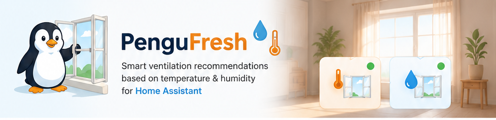
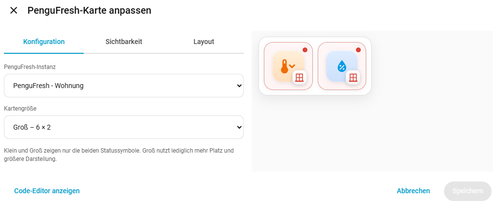
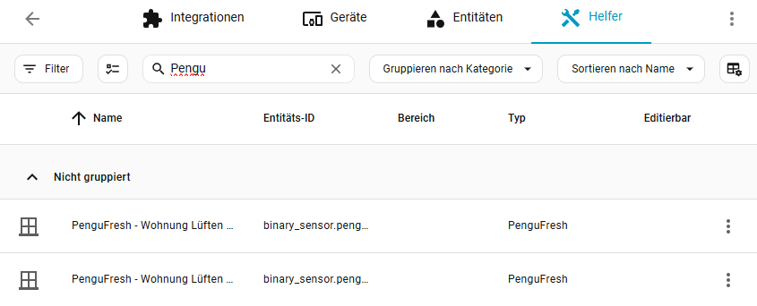
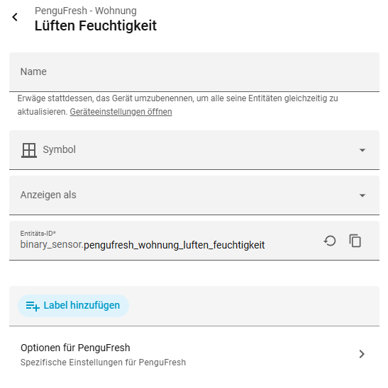
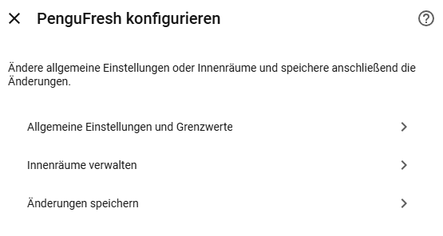

  

# PenguFresh

**PenguFresh** is a Home Assistant helper for smart ventilation recommendations. It compares indoor and outdoor **temperature** and **humidity** and uses **absolute humidity** and **dew point** to decide whether opening the windows is useful for cooling or dehumidifying.

| 🌡️ Temperature | 💧 Humidity | 🏠 Profiles | 🪟 Dashboard |
|---|---|---|---|
| Ventilate when outdoor air can cool the room | Ventilate only when outdoor air can actually remove moisture | Apartment, Basement, Garage and Room | Compact 6×1 and 6×2 PenguFresh cards |

PenguFresh supports multiple indoor rooms, multiple instances and automatic **°C / °F** handling. Each instance creates two binary sensors that can also be used in automations, conditions and templates:

- **Ventilate for heat**
- **Ventilate for humidity**

## Installation via HACS

1. Open **HACS** in Home Assistant.
2. Open **⋮ → Custom repositories**.
3. Add `https://github.com/Borderlane-HA/PenguFresh` and select **Integration**.
4. Install **PenguFresh** and restart Home Assistant.
5. Go to **Settings → Devices & services → Helpers → Create helper**.
6. Select **PenguFresh** and complete the setup.

> [!IMPORTANT]
> **PenguFresh is a Home Assistant helper integration.** Its instances are therefore managed under **Settings → Devices & services → Helpers** and do **not** appear as a normal integration card under **Settings → Devices & services → Integrations**. This is expected Home Assistant behavior.

## Dashboard card

PenguFresh includes its own dashboard card. Open a dashboard and choose:

**Edit dashboard → Add card → PenguFresh**

Then select the PenguFresh instance and the desired size:

- **Small – 6 columns × 1 row**
- **Large – 6 columns × 2 rows**

The card intentionally stays simple: the left tile represents **temperature / cooling**, the right tile **humidity**. A **green status dot** means ventilation is recommended, a **red status dot** means keep the windows closed. The window symbol changes between open and closed automatically.

  

## Managing PenguFresh helpers

All PenguFresh entities are visible in **Settings → Devices & services → Helpers**. This is the central place to find the two generated sensors for each PenguFresh instance.

  

From the Helpers view you can **edit or remove** PenguFresh helpers using the **⋮ menu** on the right side of the entry. Opening a PenguFresh entity also gives access to **Options for PenguFresh**.

<table>
<tr>
<td width="50%" valign="top">
  
</td>
<td width="50%" valign="top">
  
</td>
</tr>
</table>

Inside **Options for PenguFresh** you can change the configuration at any time:

- **General settings and thresholds**
- **Indoor rooms and their sensors**
- save the updated configuration without recreating the helper

If an instance is no longer needed, remove it from the **Helpers** view using its **⋮ menu**.

## How the recommendation works

PenguFresh does not simply compare relative humidity percentages. For humidity decisions it calculates **absolute humidity** and **dew point**, which is especially important for basements where warm, humid outdoor air can make conditions worse even if the outdoor relative humidity looks acceptable.

The selected profile provides sensible defaults for **Apartment**, **Basement**, **Garage** or **Room**, while the thresholds remain editable through the PenguFresh helper options.

---

  <strong>PenguFresh</strong> · Smart ventilation decisions for Home Assistant 
  <a href="https://github.com/Borderlane-HA/PenguFresh">GitHub repository</a> · <a href="https://github.com/Borderlane-HA/PenguFresh/issues">Issues</a>

